# ShapeRAGen 🚀

*Text-to-STL synthesis with Retrieval‑Augmented Generation (RAG)*

ShapeRAGen empowers you to transform plain-English shape descriptions into production‑ready, 3D‑printable STL models. 🚀Powered by DeepSeek‑V3 and Retrieval‑Augmented Generation (RAG), it handles hollow geometries with precision, automated printability checks, and dimensional validation.


---

## 🎯 Quick Start

1. **Clone the repository**
   ```bash
   git clone https://github.com/meanderinghuman/ShapeRAGen.git
   cd ShapeRAGen
   ```
2. **Install dependencies**
   ```bash
   pip install -r requirements.txt
   ```
3. **Set your API key**
   ```bash
   export DEEPSEEK_API_KEY="your_api_key_here"
   ```
4. **Generate a 3D model**
   ```bash
   python 3D_Gen.py \
     --shape "hollow cylinder with radius 15mm, height 40mm, wall thickness 2mm" \
     --output_dir "output/"
   ```

---

## ✨ Features

| Feature                     | Description                                                 |
| --------------------------- | ----------------------------------------------------------- |
| **Text‑to‑STL**             | Convert natural‑language shape descriptions into STL files  |
| **Retrieval‑Augmented**     | Fetch context snippets via RAG for higher‑quality code gen  |
| **Hollow Geometry Support** | Create precise wall‑thickness for hollow shapes             |
| **Printability Check**      | Automated manifold and watertight validation                |
| **Dimensional Analyzer**    | Measure generated model dimensions against requested values |

---

## 🛠️ Installation

Ensure you have **Python 3.9+**.

```bash
pip install openai requests beautifulsoup4 \
    sentence-transformers faiss-cpu trimesh numpy numpy-stl \
    pyglet manifold3d shapely pandas matplotlib seaborn
```

---

## 🚀 Usage

```bash
python 3D_Gen.py --shape "<your shape description>" [--output_dir "<dir>"]
```

- `--shape`     : Prompt describing the 3D shape and dimensions
- `--output_dir`: *(optional)* Directory for STL output (default: `output/`)

**Example:**

```bash
python 3D_Gen.py --shape "hollow cube with side length 30mm and wall thickness 3mm"
# -> output/hollow_cube.stl
```

---

## 📂 Project Structure

```text
ShapeRAGen/
├── 3D_Gen.py             # Main generation script
├── stl_analyzer.py       # Model validation & measurement toolkit
├── run_evaluation.py     # Evaluation pipelines (merged into README)
├── best_chunks.pkl       # RAG index data
├── best_embeddings.npy   # Embedding vectors for retrieval
├── requirements.txt      # Dependency list
└── output/               # Generated STL files
```

---

## 🏗️ Architecture

```mermaid
flowchart LR
  A[User Prompt]
  B[RAG Retrieval]
  C[DeepSeek‑V3 Generator]
  D[STL Synthesis]
  E[Printability Check]
  F[Dimensional Analyzer]
  G[STL File]

  A --> B --> C --> D --> E --> F --> G
```



---

## 🔬 RAG Evaluation System 🧪

Assess the impact of RAG on 3D code generation with these steps:

### 📝 Overview

1. **Baseline**: Generate code without retrieval context
2. **RAG‑Only**: Include retrieved snippets, skip review
3. **Full System**: Retrieval + review enforcement
4. **Iterations**: Repeat each setting *n* times for statistical power

---

### ⚙️ Setup

```bash
pip install -r requirements.txt
```

**Required files**:

- `best_embeddings.npy` & `best_chunks.pkl`: Retrieval index data
- `3D_Gen.py`: Generation script
- `run_evaluation.py`: Orchestrates evaluation runs

---

### 🔍 Protocol

1. **Baseline Run**: Generate models without retrieval
2. **RAG Only**: Generation + retrieval, no review
3. **Full System**: All steps
4. **Collect Metrics**: Success rate, dimension error, latency

---

### 📊 Metrics

| Metric                   | Description                                         |
| ------------------------ | --------------------------------------------------- |
| **Success Rate**         | % of STL files passing manifold & watertight checks |
| **Dimensional Accuracy** | Mean absolute error (mm) vs. requested dimensions   |
| **Latency**              | Avg. time for code gen + STL synthesis              |

---

### 🛠️ Troubleshooting

- **Missing index files**: Ensure `.npy` & `.pkl` are in repo root
- **API errors**: Verify `DEEPSEEK_API_KEY` and network access
- **Dependency issues**: Run `pip install -r requirements.txt`

